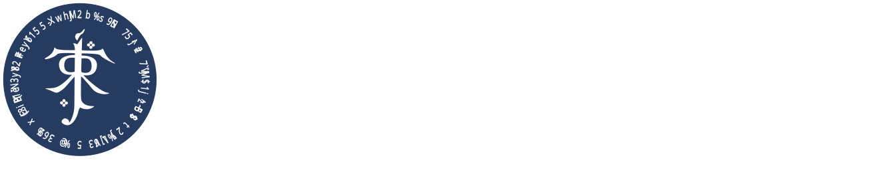

    

---

Arda PlotSquared is a land and world management plugin for Minecraft.
It includes several highly configurable world generators.
You can create plots of land in existing worlds using plot clusters, or you can have a full world of plots.

For the end user, PlotSquared is packed with a tonne of cool features.
It allows you to merge plots, and build together with your friends.
You can also change a lot of plot specific settings in the form of
flags. Such as: weather, time, game modes, pvp status.

This fork aims to bring PlotSquared to Fabric 1.20.1 with behaviour as close as possible to the original version.

## Links

* [Discord](https://discord.com/invite/qcYBkCmAKZ)
* [Issues](https://github.com/ArdaCraft/PlotSquared/issues)

### Edit The Code

Want to add new features to PlotSquared or fix bugs yourself? You can get the game running, with PlotSquared, from the code here:

For additional information about compiling PlotSquared,
see [CONTRIBUTING.md](https://github.com/IntellectualSites/.github/blob/main/CONTRIBUTING.md)

### Submitting Your Changes

Arda PlotSquared is open source (specifically licensed under GPL v3), so note that your contributions will also be open source. The
best way to submit a change is to create a fork on GitHub, put your changes there, and then create a "pull request" on our
PlotSquared repository.